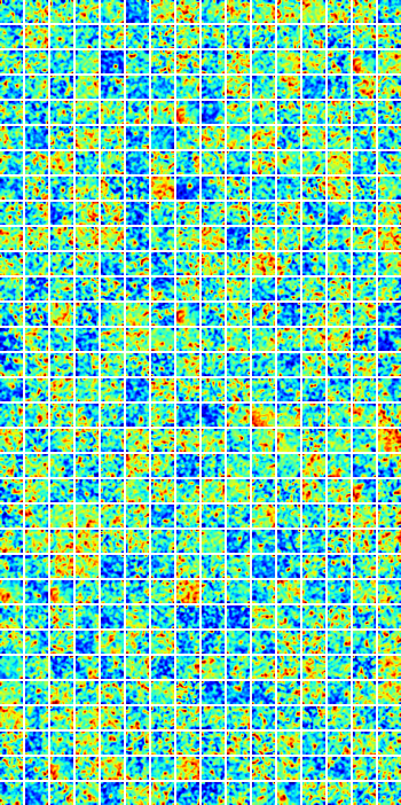

# Vector-based navigation using grid-like representations in artificial agents

## About

Replicating Google Deep Mind's paper ["Vector-based navigation using grid-like representations in artificial agents."](https://www.nature.com/articles/s41586-018-0102-6)

## Result

# References

Simulated rat movement data is taken from Unity Technologies' [rat-rnn experiment repository](https://github.com/Unity-Technologies/rat-rnn).
