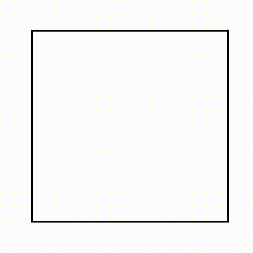
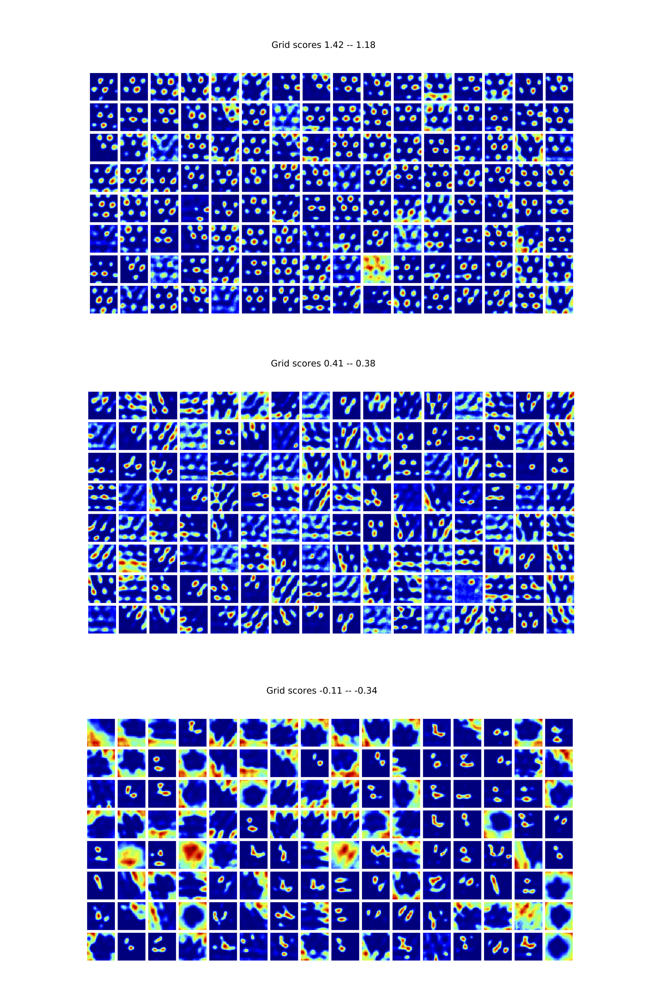

# Grid cells in RNNs trained to path integrate

Code to reproduce the trained RNN in [**a unified theory for the origin of grid cells through the lens of pattern formation**](https://papers.nips.cc/paper/9191-a-unified-theory-for-the-origin-of-grid-cells-through-the-lens-of-pattern-formation). 


Quick start:



* [**inspect_model.ipynb**](inspect_model.ipynb):
  Train a model and visualize its hidden unit ratemaps. 
 
* [**main.py**](main.py):
  or, train a model from the command line.
  
Includes:

* [**trajectory_generator.py**](trajectory_generator.py):
  Generate simulated rat trajectories in a rectangular environment.

* [**place_cells.py**](place_cells.py):
  Tile a set of simulated place cells across the training environment. 
  
* [**model.py**](model.py):
  Contains the vanilla RNN model architecture, as well as an LSTM.
  
* [**trainer.py**](model.py):
  Contains model training loop.
  
* [**models/example_trained_weights.npy**](models/example_trained_weights.npy)
  Contains a set of pre-trained weights.

```shell
$ virtualenv env
$ source env/bin/activate
$ pip install --upgrade numpy==1.17.2
$ pip install --upgrade tensorflow==2.0.0rc2
$ pip install --upgrade scipy==1.4.1
$ pip install --upgrade matplotlib==3.0.3
$ pip install --upgrade imageio==2.5.0
$ pip install --upgrade opencv-python==4.1.1.26
$ pip install --upgrade tqdm==4.36.0
```

## Result


