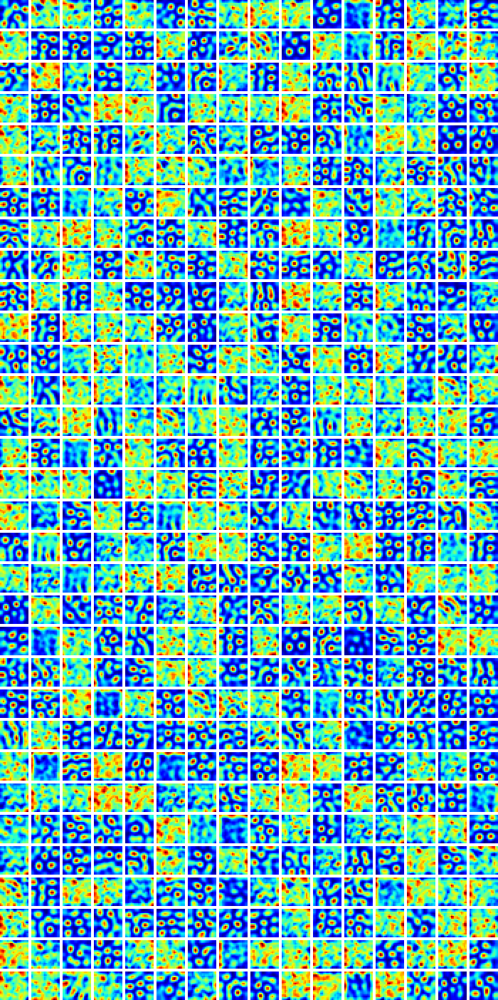

# Grid cells in artificial neural networks

Training an RNN on a path integration task produces grid-like representations. 

* [**inspect_model.ipynb**]():
  Train a model and visualize its hidden unit ratemaps.
  
* [**main.py**]():
  Or, train a model from the command line.

## Result

